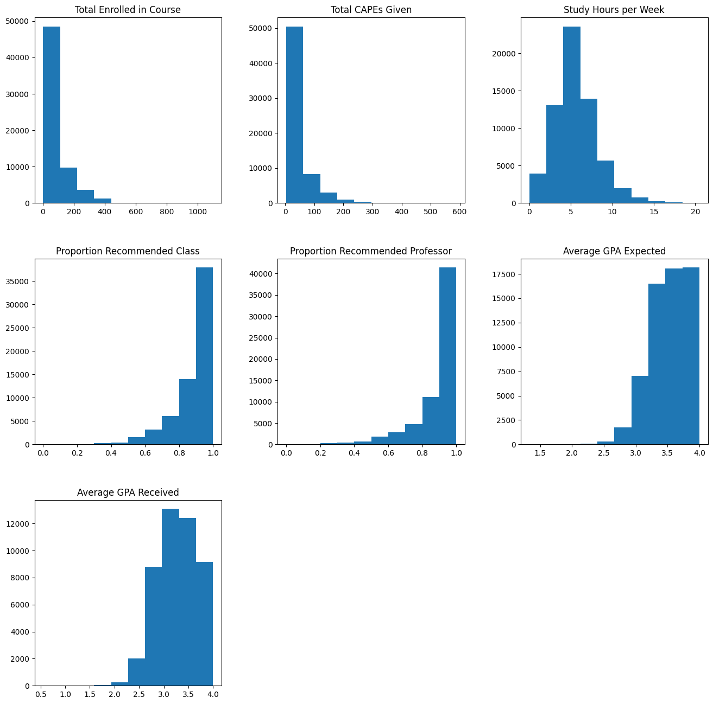

# **UCSD Course and Professor Evaluation (CAPEs) Machine Learning Exploration**

*[Link](https://drive.google.com/file/d/1fSYLGAT1rz91a4LCf_CJ20AT7SilrLFe/view?usp=sharing) to Jupyter Notebook containing all the code and explanations (you must be logged into your UCSD account)*

*Note: Embedded in each header of the writeup is a direct link to the corresponding header in the Jupyter Notebook*

# **Introduction** 

Our project leverages the power of deep neural networks to investigate the relationship between various classroom metrics and their effects on college student success. Specifically, our project seeks to define a generalized model to predict how well students may perform in a college level course (as measured GPA) when provided data about the course and its professor.

As students ourselves, we feel that this project has a lot of value because the insights gained from it can directly impact our academic journeys and those of our peers. By understanding the factors that contribute to success in college courses, we can make more informed decisions about our education, such as selecting courses with professors known to facilitate student learning effectively. Additionally, the ability to predict student performance based on various metrics can provide early intervention opportunities for students who may be at risk of struggling academically, ultimately supporting retention and graduation rates.

Moreover, we think that it’s cool that we get to utilize a dataset that many of us and former students have contributed to throughout our time at UCSD (the CAPEs dataset) and build something out of it that can benefit students in the future.

The importance of this study comes from being able to provide a model to guide academic policy decisions which can enhance the quality of education, and foster an environment that supports and maximizes student success and learning enjoyment. As students ourselves, this project provided an opportunity to see how to utilize code and data related to academic performance to learn more about our own academic performance and uncover patterns in the data that can help us know what to look for to increase odds of student success. Having a good predictive model is important to highlight important patterns and behaviors that might not be clear to the human eye but are evident in the data. In other words, a good predictive model can be useful to develop improvements and predict future outcomes by uncovering patterns in the data.

# **Methods**
* ## [Data Exploration:](https://colab.research.google.com/drive/1fSYLGAT1rz91a4LCf_CJ20AT7SilrLFe?authuser=1#scrollTo=9Wgqiln8b2Gq)
    The dataset was explored using a combination of functions available through the pandas and seaborn libraries. Below is a summary of what functions were used and what we learned about our dataset from them
    * df.info() revealed that most features in our dataset contained objects (strings) instead of numeric values
    * pd.describe() revealed that approximately 27% of our dataset had missing values
    * Creating a correlation heatmap using df.corr() and sns.heatmap() revealed that:
        * `Average Grade Expected` is very strongly correlated (positively) with `Average Grade Received` 
        * `Study hours per week` is moderately negatively correlated with  `Average Grade Expected` and  `Average Grade Received`
        * `Percentage Recommended Class` and `Percentage Recommended Professor` is moderately positively correlated with `Average Grade Expected` and  `Average Grade Received`
        * Total enrolled in course was weakly negatively correlated with `Average Grade Received`
    * Plotting the distribution of the values using hist() revealed the data was largely skewed in one direction for most features. 

* ## [Pre-Processing:](https://colab.research.google.com/drive/1fSYLGAT1rz91a4LCf_CJ20AT7SilrLFe?authuser=1#scrollTo=ql2uSH6ICs2l)
    The following techniques were used to process the CAPEs dataset:
    * ### [Encoding:](https://colab.research.google.com/drive/1fSYLGAT1rz91a4LCf_CJ20AT7SilrLFe?authuser=1#scrollTo=ZC62Zdp8uKMJ)
      * Label encoding was performed on the columns `Percentage Recommended Class`, `Percentage Recommended Professor`, `Average Grade Expected` and `Average Grade Received` to convert them from strings into numeric values
      * The feature `Course`, containing details of a course’s department and course number, was processed to separate out the department, course number, and course suffix into their own columns. These individual features were then label encoded into numeric values and appended to our dataset under the names `Department`, `Course Number` and `Course Suffix` respectively.

    * ### [Imputation:](https://colab.research.google.com/drive/1fSYLGAT1rz91a4LCf_CJ20AT7SilrLFe?authuser=1#scrollTo=GmKH15rIsQAO)
      * Prior to doing any imputing, our dataset contained missing values for the following features: ‘Study Hours Per Week’, ‘Average Grade Expected’, ‘Average Grade Received’
      * The following strategy was used to impute missing values:
        > “For every observation with a missing value for feature X, create a value for X by taking all observations with the **same department, course number, and suffix** (the same class), taking the values reported for feature X, taking the average of them, and setting that as the imputed value for X.
      * This reduced the number of observations with missing values from 5989 to 84.

      * For any remaining observations with missing values, the following strategy was used:
        > “For every observation with a missing value for feature X, create a value for X by looking at all observations within the same **department**, then taking the values reported for feature X, taking the average of them, and setting that as the imputed value for X. If this is not possible, take the average of all observations in the data set for feature X and replace the missing value with that"
      * For any observation that are still missing values, this final strategy was used:
        > "For every observation with a missing value for feature X, create a value for X by taking all observations, taking the values reported for feature X, taking the average of them, and setting that as the imputed value for X"
      * This reduced the number of observations with missing values from 342 to 0.
        
      * The following features were impacted by imputation: `Study Hours per Week`, `Average Grade Expected`, and `Average Grade Received`

      * Imputing missing data saved **~27%** of the dataset from being dropped for having missing values 
  
    * ### [Normalization:](https://colab.research.google.com/drive/1fSYLGAT1rz91a4LCf_CJ20AT7SilrLFe?authuser=1#scrollTo=cg8WdV9-sDnQ)
      * Min-Max normalization was applied to all non-categorical data after the encoding and imputing steps
      * This impacted the following features: `Total Enrolled in Course`, `Percentage Recommended Class`, `Percentage Recommended Professor`, `Study Hours per Week`, `Average Grade Expected`, `Average Grade Received`, `Total CAPEs Given`

    * ### Dropped Columns:
      * The features `Instructor` and `Evaluation URL` were dropped from our dataset
      * The feature `Course` was dropped from the dataset after being processed and expanded into `Department`, `Course Number`, and `Course Suffix` features.

* ## [Model 1:](https://colab.research.google.com/drive/1fSYLGAT1rz91a4LCf_CJ20AT7SilrLFe?authuser=1#scrollTo=pEukt66cd708)
  Model 1 consists of a DNN aimed at doing regression. It takes as input, values for the features `Total Enrolled in Course`, `Percentage Recommended Class`, `Percentage Recommended Professor`, `Study Hours per Week`, and `Average Grade Expected` and outputs a continuous value for `Average Grade Received`. It is a dense, sequential model configured with 5 hidden layers with a decreasing number of nodes all using the relu activation function. It was compiled using mean squared error as the loss function using the adam optimizer.

  The code for the model can be found below:
  ```
  model_1 = Sequential([
   Dense(units = 32, activation='relu', input_dim = X_train.shape[1]),
   Dense(units = 16, activation='relu'),
   Dense(units = 8, activation='relu'),
   Dense(units = 4, activation='relu'), 
   Dense(units = 2, activation='relu'), 
   Dense(units = 1) 
  ])
  
  model_1.compile(optimizer='adam', loss='mse')
  ```
  The model was trained on 30 epochs using a batch size of 10 with early stopping and model checkpointing enabled to save the weights that resulted in the lowest evaluation loss.

  The model was evaluated for performance and signs of overfitting by plotting training vs evaluation loss and by comparing the model’s training error (mse) with that of its testing error. 

* ## [Model 2:](https://colab.research.google.com/drive/1fSYLGAT1rz91a4LCf_CJ20AT7SilrLFe?authuser=1#scrollTo=BwvoiCvqdqry)
  Model 2 consists of a DNN aimed at doing regression. Like Model 1, it is a dense, sequential DNN outputting a continuous value for `Average Grade Received` but takes additional features on top of what model 1 already takes as input: namely `Department`, `Course Number`, and `Course Suffix`. Model 2 is also different in that hyperparameter tuning has been performed on its activation functions and optimizer with the objective of minimizing loss. The optimal results were then extracted and used to construct model 2.
  
  The code for the model (post hyper-parameter tuning) can be found below:
  ```
  model_2 = Sequential([
   Dense(units = 32, activation='tanh', input_dim = X_train.shape[1]),
   Dense(units = 8, activation='tanh'), 
   Dense(units = 4, activation='tanh'),
   Dense(units = 2, activation='relu'),
   Dense(units = 1) 
  ])

  model_2.compile(optimizer='adam', loss='mse')
  ```

  The model was trained on 30 epochs using a batch size of 10 with early stopping to save the weights that resulted in the lowest training loss.

  Like model 1, model 2 was evaluated for performance and signs of overfitting by plotting training vs evaluation loss and by comparing the model’s training error (mse) with that of its testing error. K-fold cross validation was also performed for the same purpose.

* ## [Model 3:](https://colab.research.google.com/drive/1fSYLGAT1rz91a4LCf_CJ20AT7SilrLFe?authuser=1#scrollTo=IPxG5OibLu_Q)

  Model 3 consists of a DNN aimed at doing classification. Unlike the previous models, it aims to predict the letter grade of a class given the inputs `Total Enrolled in Course`, `Percentage Recommended Class`, `Percentage Recommended Professor`, `Study Hours per Week`, `Average Grade Expected` instead of a continuous value. To do this, the dataset was modified to convert the GPA values in `Average Grade Expected` into letter grades, which were then subsequently one hot encoded. Thus, model 3 serves as a DNN that predicts multi class outputs.

  Model 3 is configured to be a dense, sequential model with 5 hidden layers all with the relu activation function and a decreasing number of nodes. To perform multi class classification, the output layer uses the softmax function and the model is compiled with the categorical cross entropy loss function with rmsprop as the optimizer. 

  The code for the model can be found below:
  ```
  model_3 = Sequential([
   Dense(units = 512, activation='relu', input_dim = X_train.shape[1]),
   Dense(units = 256, activation='relu'),
   Dense(units = 128, activation='relu'),
   Dense(units = 64, activation='relu'), 
   Dense(units = 32, activation='relu'), 
   Dense(units = y_train.shape[1], activation = "softmax")
  ])

  model_3.compile(optimizer='rmsprop', loss='categorical_crossentropy', metrics = ['accuracy'])
  ```

  As with the previous model, model 3 was trained on 30 epochs using a batch size of 10 with early stopping to save the weights that resulted in the lowest training loss.

  The model was evaluated for performance and signs of overfitting by plotting training vs evaluation loss and by comparing the model’s accuracy, recall, and precision for various classes using sklearn’s classification report for both testing and training data.

* ## [Alternative Models:](https://colab.research.google.com/drive/1fSYLGAT1rz91a4LCf_CJ20AT7SilrLFe?authuser=1#scrollTo=mOE8-sKjbVwQ)
  As an exercise, we've prepared several models using various other concepts covered in class. While they are not our main model, these models serve as an additional base of comparison for our DNNs so we have another way to compare their performance. So as to increase the readibility of the README however, detailed descriptions, code, and graphs related to these models will be excluded, though we will provide a link to them in the notebook for completeness.

  A brief summary of what they are has been provided below:
    * ### [Regression:](https://colab.research.google.com/drive/1fSYLGAT1rz91a4LCf_CJ20AT7SilrLFe?authuser=1#scrollTo=zNk0x94wefFW)
      * [Version 1:](https://colab.research.google.com/drive/1fSYLGAT1rz91a4LCf_CJ20AT7SilrLFe?authuser=1#scrollTo=urrWbi4XlcO2&line=1&uniqifier=1)
        * sklearn's LinearRegression() model was used to create a linear regression and was evaluated using K-fold cross validation of varying number of folds.
      * [Version 2:](https://colab.research.google.com/drive/1fSYLGAT1rz91a4LCf_CJ20AT7SilrLFe?authuser=1#scrollTo=nz-QTWV-41s-&line=1&uniqifier=1)
        * Hyperparameter tuning was performed to evaluate the LinearRegression() model's performance when given different inputs. The best one was then evaluated using K-fold cross validation of varying degrees.
      * [Version 3:](https://colab.research.google.com/drive/1fSYLGAT1rz91a4LCf_CJ20AT7SilrLFe?authuser=1#scrollTo=VR3Bonloltmn&line=1&uniqifier=1)
        * Used sklearn's PolynomialFeatures() to construct regression models of degree ranging from 1-5
    * ### [KNN:](https://colab.research.google.com/drive/1fSYLGAT1rz91a4LCf_CJ20AT7SilrLFe?authuser=1#scrollTo=8OI-xsyRevky&line=1&uniqifier=1)
      * [Version 1:](https://colab.research.google.com/drive/1fSYLGAT1rz91a4LCf_CJ20AT7SilrLFe?authuser=1#scrollTo=BkuuX3RC5k87)
        * Used sklearn's KNeighborsClassifier() to construct a KNN model with K = 50
      * [Version 2:](https://colab.research.google.com/drive/1fSYLGAT1rz91a4LCf_CJ20AT7SilrLFe?authuser=1#scrollTo=ux33QWXBB8mu&line=4&uniqifier=1)
        * Used sklearn's KNeighborsClassifier() to construct a KNN model with K = 200
      * [Version 3:](https://colab.research.google.com/drive/1fSYLGAT1rz91a4LCf_CJ20AT7SilrLFe?authuser=1#scrollTo=XmIlhzu6B9WR&line=3&uniqifier=1)
        * Used sklearn's KNeighborsClassifier() to construct a KNN model with K = 500

# Results
* ## [Data Exploration:](https://colab.research.google.com/drive/1fSYLGAT1rz91a4LCf_CJ20AT7SilrLFe?authuser=1#scrollTo=9Wgqiln8b2Gq)
  * df.info() revealed that most features in our dataset contained objects (strings) instead of numeric values
    * 
  * pd.describe() revealed that approximately 27% of our dataset had missing values
    * 
  * Creating a correlation heatmap using df.corr() and sns.heatmap() revealed the following correlation coefficients: 
    * 
  * Viewing the distribution of the values in each feature revealed the following skews
    * 
  
* ## [Pre-Processing](https://colab.research.google.com/drive/1fSYLGAT1rz91a4LCf_CJ20AT7SilrLFe?authuser=1#scrollTo=ql2uSH6ICs2l)
    * ### [Encoding:](https://colab.research.google.com/drive/1fSYLGAT1rz91a4LCf_CJ20AT7SilrLFe?authuser=1#scrollTo=ZC62Zdp8uKMJ)
      * Prior to encoding our dataset, the majority of the features contained objects as their value.
      * After encoding the features mentioned in the methods section, all of the features in the dataset were converted to either integers or floats
      * A before and after view of the dataset can be found below
        * Before:
        * 
        * After:
        * 
    * ### [Imputation:](https://colab.research.google.com/drive/1fSYLGAT1rz91a4LCf_CJ20AT7SilrLFe?authuser=1#scrollTo=GmKH15rIsQAO)
      * Applying the technique outlined in the methods section reduced the number of rows with missing data from 19,115 all the way to 0.
    * ### [Normalization:](https://colab.research.google.com/drive/1fSYLGAT1rz91a4LCf_CJ20AT7SilrLFe?authuser=1#scrollTo=cg8WdV9-sDnQ)
      * Min Max normalization was applied to non-categorical columns. The resulting dataset can be seen below:
        * 
    * ### Dropped Columns:
      * The features `Instructor` and `Evaluation URL` were dropped from our dataset
      * The feature `Course` was dropped from the dataset after being processed and expanded into `Department`, `Course Number`, and `Course Suffix` features.
      * This was done while encoding the data. Thus, the previews of the dataset used to show the state of the dataset after the applying the different techniques exclude these values.
* ## [Model 1:](https://colab.research.google.com/drive/1fSYLGAT1rz91a4LCf_CJ20AT7SilrLFe?authuser=1#scrollTo=pEukt66cd708)
    * Training vs Validation Loss Graph:
      * 
    * Training vs Test MSE:
      * ```
        MSE Train: 0.012811824793743347
        MSE Test: 0.012531321231611235
        ```
* ## [Model 2:](https://colab.research.google.com/drive/1fSYLGAT1rz91a4LCf_CJ20AT7SilrLFe?authuser=1#scrollTo=BwvoiCvqdqry)
    * Training vs Validation Loss Graph:
      * 
    * Training vs Test MSE:
      * ```
        MSE Train: 0.006345696507123405
        MSE Test: 0.006237075743043597
        ```
    * Losses per Fold for K-Fold Cross Validation 
      * ```
        array([0.00620253, 0.00730672, 0.00649318, 0.00584978, 0.00591005])
        ```
* ## [Model 3:](https://colab.research.google.com/drive/1fSYLGAT1rz91a4LCf_CJ20AT7SilrLFe?authuser=1#scrollTo=IPxG5OibLu_Q)
    * Training vs Validation Loss Graph:
      * 
    * Training vs Test Classification Report:
      * 
* ## [Alternative Models:](https://colab.research.google.com/drive/1fSYLGAT1rz91a4LCf_CJ20AT7SilrLFe?authuser=1#scrollTo=mOE8-sKjbVwQ)
    * The writeup and graphs/figures for our alternative models can be found [here](https://docs.google.com/document/d/180wuSjsLb7TfzJrvCK-ozx-NGKtKmpJtxVN_tb7Ghd8/edit?usp=sharing)
    * The results of the best models are displayed below for convenience:
      * ### [Regression:](https://colab.research.google.com/drive/1fSYLGAT1rz91a4LCf_CJ20AT7SilrLFe?authuser=1#scrollTo=zNk0x94wefFW&line=1&uniqifier=1)
        * Utilizing a degree of 4 produces a model with a test MSE loss of 0.07478621
      * ### [KNN:](https://colab.research.google.com/drive/1fSYLGAT1rz91a4LCf_CJ20AT7SilrLFe?authuser=1#scrollTo=8OI-xsyRevky&line=1&uniqifier=1)
        * Utilizing K = 50 yields a model with an accuracy score of 0.7852915647439438 for test data
# Discussion
* ## [Data Exploration:](https://colab.research.google.com/drive/1fSYLGAT1rz91a4LCf_CJ20AT7SilrLFe?authuser=1#scrollTo=9Wgqiln8b2Gq)
* As our goal is to build a DNN that predicts student grades, we felt that it was first important to explore our dataset to find any correlations between other features and our target so that we could determine what inputs to include in our model. Thus, we made use of the corr() method in pandas to compute the correlation coefficient between all the features in our dataset and plotted them using heatmap() from seaborn with a diverging color scale. This made it easy to visually spot which features were more strongly correlated with “Average GPA Received” and whether the association was positive or negative. After doing so, we identified that the features “Average Grade Expected”, “Study hours per week”, “Percentage Recommended Class”, “Percentage Recommended Professor” had strong or medium levels of correlation with our target, which gave us our inputs.
> * Note: we also decided to consider the feature “Total Enrolled In Class” as an input even though it had a weak negative correlation (-0.22) with our target. This came from discussion about whether or not students generally do better in smaller courses or ones with a larger amount of students. Thus, we felt that it was a good idea to also include it as a possible input for our model. In retrospect, we probably should have only selected features with a medium or strong correlation to our target feature as that would’ve likely made it easier for our model to achieve better predictive performance (by eliminating noise caused by features that aren’t that “useful”).

* ## [Pre-Processing:](https://colab.research.google.com/drive/1fSYLGAT1rz91a4LCf_CJ20AT7SilrLFe?authuser=1#scrollTo=ql2uSH6ICs2l)
    * ### [Encoding:](https://colab.research.google.com/drive/1fSYLGAT1rz91a4LCf_CJ20AT7SilrLFe?authuser=1#scrollTo=ZC62Zdp8uKMJ)
      * Encoding was performed because the majority of the features in our dataset contained strings as values. Thus, in order to use them as inputs for our models, we needed to turn them into numbers first. Fortunately, many of them were easy to convert into a numeric value because the number we wanted was already contained within the string. This meant that we were able to write some RegEx to extract the numeric values we needed from the problematic columns. We then overwrote those columns with their extracted numeric values. This was applied to the columns `Percentage Recommended Class`, `Percentage Recommended Professor`, `Average Grade Expected` and `Average Grade Received`.

      While these were the only features we really needed to encode, we figured that we might as well encode some extra features in the dataset in case we needed to use them later (which we did). This led us down a path to encode the `Quarter` and `Course` feature, which was a bit more complicated. 
        
      To encode `Quarter`, we noticed that the entries under this feature were all in the format XXYY where XX referred to the quarter and YY referred to the year a particular course was offered. This meant that we could again write some RegEx to separate out the quarter and year into their own features `Quarter` and `Year`. As `Year` was already a number, we simply added 2000 to it to make it more interpretable.  To handle `Quarter` we just performed label encoding on it as quarters tend to have an order associated with them (fall -> winter -> spring…).

      To encode `Course` we observed that entries for this feature were basically all in the format Department + Course Number + Course Name. Since we really only needed the department name and course number to identify a class, we realized that we could just ignore the course name. This meant that we could encode values in `Course` by separating out the department and the course numbers into their own columns (`Department` and `Course Numbers` respectively). However, since some courses had a suffix assigned to them (MATH 20A), we also had to extract that too and create a new column, `Course Suffix`. As with before, this was achieved with RegEx. From there, the course numbers themselves could safely just be converted into integers, but we had to encode the department and suffixes as they were entirely strings. Since there were quite a few departments and suffixes, we just label encoded them by assigning a numeric value to each based on their lexicographic ordering instead of doing one hot encoding to reduce the number of features in our dataset.

    * ### [Imputation:](https://colab.research.google.com/drive/1fSYLGAT1rz91a4LCf_CJ20AT7SilrLFe?authuser=1#scrollTo=GmKH15rIsQAO)
      * The choice to try to impute missing data was driven by the discovery that around ~27% of our dataset contained missing values. While we considered dropping them since our dataset was sufficiently large enough, we decided to try to impute as many entries as possible before resorting to dropping.
      * Once we learned that the bulk of the missing values were for the columns ‘Average Grade Expected and “Average Grade Received” we reasoned that we could fill those values by looking at other instances of the same class (as identified by having the same department number, course number, and course suffix) and replace the missing value with the average of the values from said classes. This technique managed to reduce the number of observations with missing values to <10% of our dataset. While we figured we could just stop there, we decided to look a bit further into it in between milestones and discovered that some classes only occurred for one instance. This meant that we couldn’t compute a value to replace the missing one. Fortunately, we realized we could just utilize the same technique as before, but with a slight modification. While less ideal, we could just look at other classes in the entire department and generate any replacement value by averaging the values observed in said classes. Failing that (i.e. if the department only had the class with the missing value), we resorted to broadening our scope and viewing the entire dataset. We determined that we could still compute a value by taking the average of all the values for the feature with a missing value. This basically served as a catch all filter that imputed all of the data with missing values in our dataset! Thus, we were able to avoid the need to drop any entries from our dataset.

    * ### [Normalization:](https://colab.research.google.com/drive/1fSYLGAT1rz91a4LCf_CJ20AT7SilrLFe?authuser=1#scrollTo=cg8WdV9-sDnQ)
      * We chose to min-max normalize non-label values in our dataset as it was mentioned in class that normalizing data was necessary if we ever needed to perform stochastic gradient descent optimization since it is sensitive to scale.

      * The decision to choose min-max normalization in particular was made because some of our features already appeared to be min max normalized once we converted them into numeric values (“Percentage Recommended Class” and "Percentage Recommended Professor all had values between 0 and 1), thus we figured we might as well choose to min max normalize the rest of our data.
  
    * ### Dropped Columns:
      * The features “Instructor and Evaluation URL” were dropped from our dataset. This was because “Evaluation URL” just contained links to the CAPEs report that corresponded to a particular entry. While the report had a bit more information that wasn’t in the dataset, what we had already contained all the key information pertaining to class and enrollment demographics, which is what we were interested in in the first place. 
      * Additionally, we felt that it was appropriate to exclude instructor names from our analysis for privacy and ethical reasons. This is because our goal is to develop a model that the school and other students can use to understand and improve student success (as measured by grades) and we wouldn't want a particular professor to have an influence on our model as that might lead to favoritism or other workplace related issues. Since we already have a measure of how much the students like their professor in Percentage Recommended Professor, we figured we could safely strip away the name and just have a measure of how much students enjoy their professor without having any names attached.

* ## [Model 1:](https://colab.research.google.com/drive/1fSYLGAT1rz91a4LCf_CJ20AT7SilrLFe?authuser=1#scrollTo=pEukt66cd708)
  * We decided to go with a simple dense, sequential model much like what we’ve been developing in the HWs for this class. The primary reason for this was to get us started with something familiar that we could all debug if anything went wrong. Likewise many of the design choices for the model were made using observations we’ve seen from neural networks throughout the quarter. For instance, we chose to use the relu function for all hidden layers as it seems that it is often the go-to default activation function for most DNNs. Likewise, looking at figures of DNNs shown in class revealed that many had a decreasing number of nodes in each layer. After looking into this, we discovered that doing so was generally associated with better performance so we incorporated that idea into our first model. Since our model was aimed at doing regression, we took what we learned from HW2 and compiled it using the ‘mse’ loss function, which is commonly used for DNNs performing regression. Admittedly, the optimizer (adam) was a bit of a random choice, but we would later discover when we performed hyperparameter tuning that all of the best results used that particular optimizer, so we may have lucked out in that regard.
  
  * We evaluated our model’s performance by comparing the model’s training and test loss as well as by plotting the training vs validation loss during the model’s training. This gave us a good idea if overfitting was occurring because if the training loss was significantly lower than the test or validation loss, there is a good chance that our model was overfit to the training data. After doing so we learned that our training vs test loss was surprisingly similar, which was a good sign that our model was generalizing well, but when we looked at our training vs validation loss graph, it looked a bit strange. As expected, the training loss decreases rapidly at the beginning and starts to stabilize, but our validation loss appears to stay flat. While this would normally be considered overfitting, the validation loss stays flat at the value where the training loss converges to. This meant that by the time our model was done training, it performed about the same with the training data as it did with the validation data. This was further verified when we evaluated the test loss, which was also shockingly similar to this value. This suggested to us that our model was not overfitting.

* ## [Model 2:](https://colab.research.google.com/drive/1fSYLGAT1rz91a4LCf_CJ20AT7SilrLFe?authuser=1#scrollTo=BwvoiCvqdqry)
  * It seemed from the writeup that model 2 was meant to be an iterative improvement over model 1, so we performed a hyperparameter sweep over the activation functions and optimizer for model 1 in a quest to further reduce our mse loss. The reason we chose to optimize just the activation functions and optimizer was primarily due to time. As the number of distinct combinations of parameters grows exponentially with the more features we choose to tune, we were limited in what we could do with the Google Colab environment (tuning the activation functions and optimizer meant that we already had 6 parameters to tune, each of which could have multiple options to choose from). Ultimately, we settled on just choosing between two activation functions, relu and tanh for each layer as:
      * Experimentation with sigmoid (not shown in notebook) generally appeared to result in worse loss than what we saw in model 1
      * We learned that linear is generally worse than relu as relu introduces non-linearity
  
  * Additionally, tuning for the optimizer was performed to identify if some of the other popular alternatives like sgd or rmsprop were better than the initial configuration of adam. At the time, the loss function was not tuned as we felt that was already appropriate for the given task. However, in retrospect, we feel that it would have been advisable to also tune the loss function to further increase the difference between model 2 and model 1, especially since there are so many different ways to calculate error for regression type problems.

  * After performing the hyperparameter tuning, we noticed that the optimal configuration was really not that much different from model 1, except where relu was replaced with tanh. We observed from the summary of the hyperparameter tuning that the best results tended to use tanh in the first few layers, and we suspect this has to do with the output of the tanh function helping in convergence early on during training as the output values are between -1 and 1. Likewise, the same optimizer that we chose for model 1 remained the optimal one for model 2. After doing some research, it appears that adam converges faster than alternative optimizations like rmsprop and sgd, which may be helping us find a local minima faster.

  * To evaluate our model’s performance, we did the same things as model 1, but also performed k-fold cross validation to further evaluate overfitting since we observed a large improvement to our loss after hyperparameter tuning. Comparing training vs test error revealed that our model was performing quite similarly to unseen data as it did with seen data. Moreover, the results of the k-fold validation with 5 folds revealed that the mse across the 5 splits did not differ greatly from each other. This tells us that our model still generalizes well to new data. Furthermore, looking at the training vs validation loss graph shows that as the training loss decreases with respect to epochs, the validation loss follows suit. This time, however, the reduction in loss is much more gradual, which fits how we’d expect the loss to decrease in each iteration anyways. As with model 1, the loss for both training and validation data appears to converge at a similar value at the end of the training, which suggests that it is not overfitting the training data as well.

* ## [Model 3:](https://colab.research.google.com/drive/1fSYLGAT1rz91a4LCf_CJ20AT7SilrLFe?authuser=1#scrollTo=IPxG5OibLu_Q)
  * For model 3, we wanted to experiment with the difference between using a different loss function compared to the other models. Because we are dealing with a classification problem, we wanted to see what would happen if we used a different type of loss function meant for categorization and what effect it would have on the accuracy. Overall, our goal with each model is to make changes that would ultimately help us develop the best model possible. For this one, we set it up as a DNN that uses categorical cross entropy with accuracy being a part of the metrics. Using categorical cross entropy, we also made sure that the output layer used softmax as an activation function and had the number of classes, in this case the classes were the grades received, as the number of neurons. This was a significant change compared to the other models. We also wanted to find the best set of activation functions so we used hyperparameter tuning. However, after we set up the model and evaluated the results, we saw that the model had originally performed worse and had a low accuracy around 40%. The loss was also much higher than what we observed in the previous models.

  * To attempt to fix the accuracy, we did some more data preprocessing. Looking into the data further, we saw that the data set is pretty unbalanced for a classification problem. We missed this in the main data preprocessing section because we were not considering classes in our target variable. Now that we are though, this presents an issue.

  * To try and solve the issue, we did the following:

    * Since there was only one class in the entire dataset where students receive an average grade equal to or below a D, we dropped that entry. Additionally, people using our model are probably not looking for ways to decrease student success, so it's more valuable to focus on what features result in higher grades.
    * Removed the pluses and minuses. It seems that in our initial classification model, there were too many classes, which may have hurt our model's performance. Intuitively, we know that the same class can have varying values for the average GPA received even when many aspects of the class remain the same as in previous quarters. To account for that variability, we reduced the number of classes to just A, B, and C. We can interpret them as follows: (A = high student success, B = average student success, C = poor student success )
    * Performed oversampling to increase representation of less represented letter grades.

  * After doing this additional data preprocessing, we tried model 3 again and the accuracy improved significantly by about 20%. The new accuracy for model 3 is approximately 63-65%. Overall, we saw a significant improvement in the performance of model 3 where we used categorical cross entropy as the loss function when we simplified the classes further and performed oversampling along with hyperparameter tuning. This really showed us the importance of evaluating the model and always taking a look back at the data to understand why a model might be performing in a specific way.

* ## [Alternative Models:](https://colab.research.google.com/drive/1fSYLGAT1rz91a4LCf_CJ20AT7SilrLFe?authuser=1#scrollTo=mOE8-sKjbVwQ)
  * Discussion for our alternative models can be found [here](https://docs.google.com/document/d/180wuSjsLb7TfzJrvCK-ozx-NGKtKmpJtxVN_tb7Ghd8/edit?usp=sharing) 

  * A summary comparing the results of said models to our DNNs has been provided below:
    * Interestingly, it appears that our best regression DNN outperforms our best polynomial regression model by quite a large margin (~0.007 vs ~0.075, a >10x difference in MSE loss). However, our classification DNN performs worse than the best KNN classifier we were able to produce. While we should admit that the input parameters are different between these models, it's interesting to see that given the same dataset, models with different architectures can perform better than others. We suppose the greatest takeaway is that a DNN is not the solution for everything. While it can be better at one task, there are other models that perhaps lend themselves better to particular tasks.

# Conclusion

This team probably did more work than the project intended, and it turned out to be a positive thing, considering we learned a lot about the different models, such as regression and KNN. The team was divided into working on the three different models and each provided its own struggles and its own results. 

We initially started the project by developing three different kinds of models, linear regression, polynomial regression, DNN, and neural networks with an initial goal of using different types of models to predict different target variables in the dataset. It soon became clear that this was a bit of an overkill so instead we shifted the focus to predicting grades based on the given features. The preprocessing was a significant part of this process and through data exploration, we were able to clean up our data and optimize it for a given model. Our goal was to create the best model by making tweaks to our DNN, with hyperparameter tuning, differing loss functions, and different layer structures, to see what changes and optimizations would improve the model’s accuracy. While we did get the accuracy for model 3 to be more than 50%, considering that it was only approximately 65%, there is still room for improvement. Our results seem to suggest that prediction via classification may not be the best way to accomplish our goal of predicting received GPAs. This may be because the data from the CAPES was continuous. By processing these grades into classes A, B, C, D, and F the nuance of where the GPAs fall within each class is lost leading to the misclassification of edge cases (i.e. 2.9 GPA vs 3.1). However the general shape of the distribution is generally the same despite the loss in accuracy. 

In our analysis of linear regression, we developed multiple versions of linear regression models to predict average grades received. Initially, we compared the performance of our models using different folds of cross-validation, namely 3-fold, 5-fold, and 10-fold. We observed variations in mean squared error (MSE) for both training and testing datasets across these cross-validation strategies, but ultimately concluded that this variation was not enough to show signs of overfitting. The following models included feature selection and polynomial regression.

For the second model, we wanted to see which features actually had the most influence on average GPA. Our testing revealed that increasing the number of features generally reduced MSE, with significant improvements observed when transitioning from one to two features. Ultimately, we found that utilizing all available features notably decreased MSE compared to the initial hand-picked features.

In the third model, polynomial regression was employed with varying degrees. It was observed that increasing the degree of polynomial features led to a gradual decrease in MSE up to a certain point, beyond which overfitting became evident, leading to an increase in test MSE. The best performance was achieved with a polynomial regression of degree 4, yielding the lowest test MSE of 0.07478621.

The regression models had comparable results to that of model 1 and model 2 of the DNN due to the fact those models were also predicting using regression. The DNNs generally performed a bit better than the regression models likely due to the layering involved in the DNNs creation. The KNN models are similar to the third model of our DNN because they both seek to perform predictions through classification. Both models struggled with the same problem of a loss in accuracy for the continuous nature of the data as described above. The KNN ended up predicting an accuracy of around 78% compared to that of the DNN which had about a 65% accuracy. The difference is likely because KNN is better at distinguishing specific groupings within data. It must be stated that all models provided mostly accurate predictions nonetheless.

Taking this project further, some optimizations that we could consider trying out is using hyperparameter tuning for model 3. Initially, we did perform hyperparameter tuning but because the accuracy ended up being so low, we had to switch gears and focus on exploring the data further and doing more preprocessing to improve the model’s accuracy. 

# Collaboration

## Owen:
- Wrote initial code for data preprocessing
- Majority of READMEs for each milestone
- Majority of code for training and evaluating DNN models
- Commentary for DNN models in notebook
- Final writeup: methods, results, and discussion for DNN models, data exploration, and data preprocessing (converted from Google Doc to README.md)

## Darryl:
- Helped write proposal revision for Milestone 1 resubmission
- Data preprocessing coding and descriptions: label encoded course suffix, imputed NaNs, normalized data
- Regression models: wrote all the code under the Regression header
- Data preprocessing code for KNN model
- Final write-up: methods, results, and discussion for polynomial regression model
- Embedded all notebook links to headers in the final write-up and did a final proofread
- Attended and contributed to all team meetings; frequented TAs OH for project direction clarity

## Milana:
- Attended majority of group meetings
- Majority of plotting for preprocessing milestone 1
- Initial linear regression model for model 1
- Initial KNN for model 2
- Analysis for K-fold cross validation for linear regression model
- Hyperparameter tuning, DNN model coding, and plotting results for first "version" of model 3
- Contributed to final write-up, especially discussion sections for model 3, regression models 1 & 2, formatting/image links, and conclusion

## Andrew:
- Set up server for communication and GitHub for results
- Initial write-up for Milestone 1
- Data exploration for preprocessing Milestone 2
- Created fitting graphs for models and discussed comparisons regarding loss
- Worked on final Introduction, results, conclusion, and writeup conversion to Markdown

## Ian:
- Attended every group meeting
- Contributed to initial data exploration and writeup
- General revision and cleanup of earlier milestones
- Worked on write-ups for Model 2 (Linear Regression) for Milestone 3
- Contributed to major revision of Linear Regression write-up and transition to three iterations
- Explored first linear regression model more in-depth with team
- General revision and error-checking for every section of final write-up

## Luke:
- Preliminary data exploration on CAPES dataset
- Documented introduction and research intent
- Provided context for Linear Regression model in write-up
- Discussed approaches to improve model performance without overfitting
- Added analytical insights to Linear Regression model in conclusion section

## Enrique:
- Attended every group meeting
- Took notes for one meeting for absent members
- Contributed to part of the final write-up

## Vincent:
- Attended all group meetings and participated in brainstorming
- Worked with Andy on coding three KNN models and plotting results
- Proofread models and final write-up, correcting errors
- Wrote models, results, and discussion section for KNN Model
- Contributed to conclusion by comparing all models and discussing DNN shortcomings

## Andy:
- Adjusted preprocessing data for KNN model
- Co-wrote 3 KNN model iterations with Vincent
- Tested optimal k values and plotted histograms for model accuracy
- Contributed to discussion section analyzing model performances
- Attended most group meetings and discussed model selection
- Revised previous code for smooth functioning
